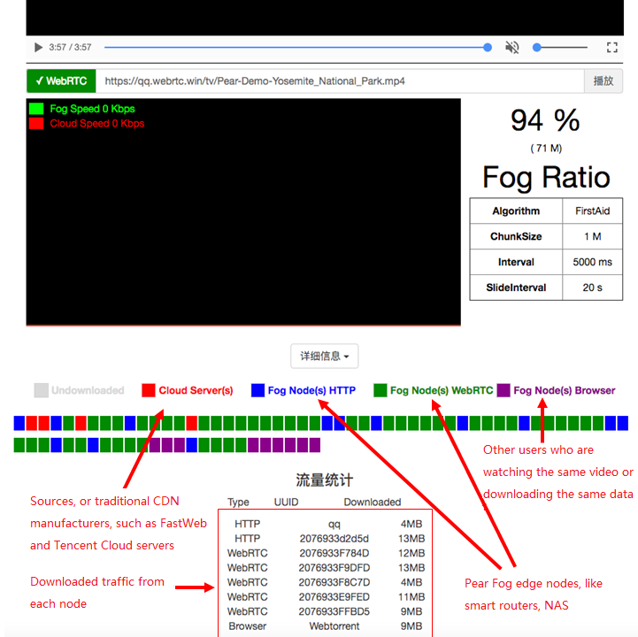

<h1 align="center">

</img>
  <br>
  <a href="https://demo.webrtc.win/player">PearPlayer.js</a>  <br>
  <br>
</h1>
<h4 align="center">A Streaming Media Player that Supports Multi-protocol, Multi-source and Mixed P2P-CDN</h4>
<p align="center">
.  <a href="https://www.npmjs.com/package/pearplayer"></a>
   <a href="https://www.jsdelivr.com/package/npm/pearplayer"></a>
 <a href="https://www.jsdelivr.com/package/npm/pearplayer"></a>
</p>
<br>

**[English](https://github.com/PearInc/PearPlayer.js/blob/master/README_EN.md)**

PearPlayer (梨享播放器) **[[Demo](https://demo.webrtc.win/)]** is a streaming media player framework written completely with HTML5 and JavaScript. Combining HTTP (including HTTPS, HTTP2) and WebRTC, the player achieves the streaming media acceleration on Web client side, which features multi-protocol, multi-source, low latency and high bandwidth utilization. H5 MSE (Media Source Extension) technology can allocate the buffer block from multi-source nodes to the player. What's more, a well-designed algorithm has been used to achieve the best scheduling mechanism and to configure to failover automatically. Thus, PearPlayer can provide users with wonderful video watching experience while maximizing the P2P ratio at the same time.


<br>
<br>

PearPlayer can be used by just importing `pear-player.min.js` through the `<script>` tag to HTML. Refer to [code examples](#快速开始) below, or [`/examples/player-test.html`](/examples/player-test.html) for usages. Refer to [get-started](docs/get-started.md) to know the basic usage.<br/> 


## Features
- Plugin-free because of P2P ability based on WebRTC
i- Multi-protocol (HTTP, HTTPS, WebRTC) and multi-source
-	Self-developed scheduling algorithm provides the users with wonderful video watching experience while maximizing the P2P ratio at the same time.
-	No parameters needed to be entered by default (The system can self-adapt according to the video bit rate, etc.). Algorithms and parameters can be adjusted in advanced mode.
-	Buffers are limited to save bandwidth/traffic for CP users.
-	Support Chrome, Firefox, Opera, IE, Edge and other mainstream browsers; Will support Safari, Tencent WeChat and X5/TBS (Multi-source transmission is enabled; The playing issues can shortly be well resolved by MSE.) 
-	Optional access to low cost, high availability Pear Fog CDN
-	Fully encrypted via TLS/DTLS by default, no DPI features; Statistical characteristics can be further eliminated using dynamic port mapping of Pear Fog pack.
-	As easy as using HTML5 <video> script tag; Easy to integrate with popular player fameworks like video.js
- With Browser P2P ability（based on WebTorrent）

f
## Quick Start
iPlease copy the following codes into Web HTML5 code, and then open a webpage. Now, it's time to witness the miracle.

```html<script src="https://cdn.jsdelivr.net/npm/pearplayer@latest"></script>
<video id="video" controls></video>
<script>
  var player = new PearPlayer('#video', { src: 'https://qq.webrtc.win/tv/Pear-Demo-Yosemite_National_Park.mp4' });
</script>
```
## Usage
###  Import js file and bind to video tag
fFirst import the <script> tag to pear-player.min.js:
```html
<script src="./dist/pear-player.min.js"></script>
```
or use CDN:
```html
<script src="https://cdn.jsdelivr.net/npm/pearplayer@latest"></script>
```
If use video tag to play the following video, please see HTML below:
```html
<video id="pearvideo" src="https://qq.webrtc.win/tv/Pear-Demo-Yosemite_National_Park.mp4" controls>
```
PearPlayer can be bound to the video tag using only the codes below:
```html
<script>
  /**
  * The first parameter is ID or CLASS of the video tag
  * Opts, the optional parameter configuration
  */
  if (PearPlayer.isMSESupported()) {
    var player = new PearPlayer('#pearvideo', opts);
  }
</script>
T```
Congratulations! NOW your player has P2P ability and no plug-ins!

### How to accelerate your videos?
The videos above has already been dispatched. So how to speed up other videos? It's a piece of cake. Just add your video URL into [Video distribution system](https://oss.webrtc.win/). And then you can feel free to use Pear's massive nodes to accelerate your videos! Please click [here](https://manual.webrtc.win/oss/) for detailed guide. (Now only support `MP4`format. You need to add `Pear-Demo` in front of the video name, such as `Pear-Demo-movie.mp4`)

## Who's using PearPlayer today？

+ [Pear Limited](https://pear.hk)
+ [Lenovo China](https://www.lenovo.com.cn/)
+ [Newifi xCloud](http://www.newifi.com/)
+ [FastWeb](http://fastweb.com.cn/)
+ [UCloud](https://www.ucloud.cn)
+ [Tencent Cloud](https://qcloud.com)
+ [Tencent X5/TBS](https://x5.tencent.com/tbs/)
+ [Tencent APD](http://www.chinaz.com/news/2016/0707/548873.shtml)

## PearPlayer Documents
- **[get-started ](docs/get-started.md)**
- **[API](docs/api.md)**

## Acknowledgement
Special thanks goes to the following projects that provide some inspirations and API design references:

- [WebTorrent](https://github.com/webtorrent/webtorrent)
- [Peer5](https://www.peer5.com/#)

## Speech and Media Reports

- Feb 2018 (36Kr) - [「Pear Share」practises fog computing, behind millions of fringe nodes are efficiency promotion and cost control](http://36kr.com/p/5118.html) 
- Nov 2017 (Gold Science and Technology) - [DITING Technologies Inc. officially enters the blockchain domain and invests Pear Limited](http://www.jinse.com/blockchain/99767.html)
- Sep 2017 (Future Network and Open Community Alliance) - [Fog Computing rises after Cloud Computing - Have a discuss on P2P CDN](https://mp.weixin.qq.com/s/39dfSA6cTj2eoo-KqsC3AQ)  
- Aug 2017 (IT biggie talk) - [Will WebRTC be the mainstream? Here comes the era of CDN crowdsourcing!](http://mp.weixin.qq.com/s/cx_ljl2sexE0XkgliZfnmQ)
- Jul 2017 (OSChina) - [PearPlayer.js - A streaming media player supports Mixed P2P-CDN](https://www.oschina.net/p/PearPlayerjs)
- Jun 2017 (Tencent Frontend Conference) - [P2P-CDN streaming media acceleration based on WebRTC](http://www.itdks.com/dakalive/detail/2577)
- May 2017 (Southern University of Science and Technology) - Edge Computing and Shared Fog Streaming
- May 2017 (Feng Chia University) - A Cooler Fruit Venture: Scaling up a Network from Cloud to Fog with Crowdsourcing
- Aug 2016 (Hong Kong University of Science and Technology) - From Cloud to Fog: Scaling up a Network with Crowdsourcing

## License

MIT. Copyright (c) [Pear Limited](https://pear.hk) and [snowinszu](https://github.com/snowinszu).

## Help and Support
E-mail: <service@pear.hk>; User QQ group:`373594967`; [CP/CDN, OEM and other business cooperations](https://github.com/PearInc/FogVDN)
